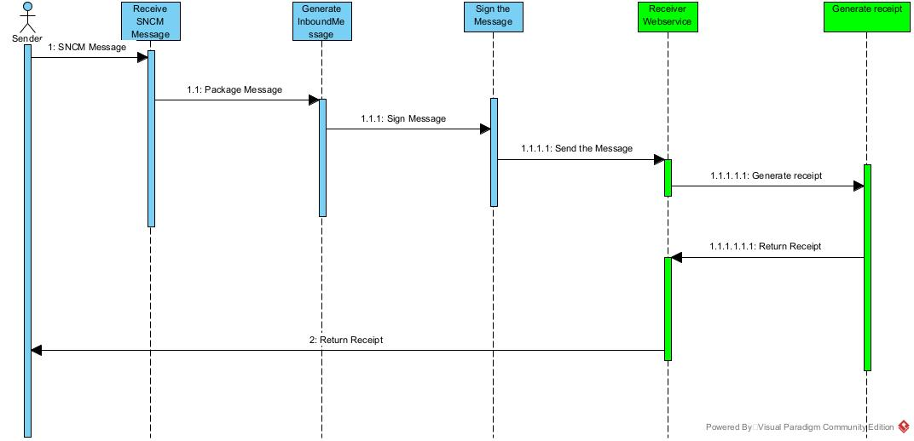

# Shipment Sample

Imagine you are a Manufacturer and you are trying to send to a Distributor a transaction.

First of all, you need to generate the information about your shipment and submit it to SNCM.

In this scenario, you are the CNPJ 15042274000195 and you are sending 3 serialized units to the CNPJ 83042274000167.

- Sender - CNPJ 15042274000195 (Manufacturer)
- Receiver - CNPJ 83042274000167 (Distributor)

> Just to give a clear information, 
> the messages in this sample
> do not have the SIGNATURE tags

### Communication flow



### Sending message to SNCM

This is the message you sent to SNCM:

```xml
<?xml version="1.0" encoding="UTF-8" standalone="yes"?>
<msgEvtIn xmlns="http://sncm.anvisa.gov.br/">
    <docId>38C78456D9444E609F4E</docId>
    <ccTime>2021-08-19T19:29:31Z</ccTime>
    <ver>0.01</ver>
    <lc>pt-BR</lc>
    <env>1</env>
    <declarant>
        <cnpj>15042274000195</cnpj>
    </declarant>
    <mbrAgt>15042274000195</mbrAgt>
    <usrAgt>T2 Software S.A - V1.0</usrAgt>
    <evts>
        <shpt>
            <evtNotifId>73A1E095C3B547F281FF</evtNotifId>
            <realTime>true</realTime>
            <pastTime>2021-08-19T19:29:31Z</pastTime>
            <fit>false</fit>
            <prtnr>
                <cnpj>83042274000167</cnpj>
            </prtnr>
            <carrs>
                <car>
                    <cnpj>73042274000167</cnpj>
                </car>
            </carrs>
            <pld>
                <dui>
                    <gtin>07891234545454</gtin>
                    <serl>01010101001010</serl>
                    <exp>2021-08</exp>
                    <lot>LOTE</lot>
                </dui>
                <dui>
                    <gtin>07891234545454</gtin>
                    <serl>01010101001011</serl>
                    <exp>2021-08</exp>
                    <lot>LOTE</lot>
                </dui>
                <dui>
                    <gtin>07891234545454</gtin>
                    <serl>01010101001012</serl>
                    <exp>2021-08</exp>
                    <lot>LOTE</lot>
                </dui>                
            </pld>
        </shpt>
    </evts>
</msgEvtIn>
```

### Preparing the Horizontal Communication

Once you have the message, you need to inform the Distributor that you are sending the goods to him.
To perform this operation you need to package this information into a Horizontal Communication message InboundMessage and you also need to know the address of his webservice.

You have two options to use inside the InboundMessage message.

- Store the message in a public address and use the fileurl tag;
- Encode the message in a BASE64 format and use the filecontent tag

In this example, we will use the base64 format.

The message above in BASE64 seems like below.

```base64
PD94bWwgdmVyc2lvbj0iMS4wIiBlbmNvZGluZz0iVVRGLTgiIHN0YW5kYWxvbmU9InllcyI/Pgo8bXNnRXZ0SW4geG1sbnM9Imh0dHA6Ly9zbmNtLmFudmlzYS5nb3YuYnIvIj4KICAgIDxkb2NJZD4zOEM3ODQ1NkQ5NDQ0RTYwOUY0RTwvZG9jSWQ+CiAgICA8Y2NUaW1lPjIwMjEtMDgtMTlUMTk6Mjk6MzFaPC9jY1RpbWU+CiAgICA8dmVyPjAuMDE8L3Zlcj4KICAgIDxsYz5wdC1CUjwvbGM+CiAgICA8ZW52PjE8L2Vudj4KICAgIDxkZWNsYXJhbnQ+CiAgICAgICAgPGNucGo+MTMwNDIyNzQwMDAxOTU8L2NucGo+CiAgICA8L2RlY2xhcmFudD4KICAgIDxtYnJBZ3Q+MTMwNDIyNzQwMDAxOTU8L21ickFndD4KICAgIDx1c3JBZ3Q+VDIgU29mdHdhcmUgUy5BIC0gVjEuMDwvdXNyQWd0PgogICAgPGV2dHM+CiAgICAgICAgPHNocHQ+CiAgICAgICAgICAgIDxldnROb3RpZklkPjczQTFFMDk1QzNCNTQ3RjI4MUZGPC9ldnROb3RpZklkPgogICAgICAgICAgICA8cmVhbFRpbWU+dHJ1ZTwvcmVhbFRpbWU+CiAgICAgICAgICAgIDxwYXN0VGltZT4yMDIxLTA4LTE5VDE5OjI5OjMxWjwvcGFzdFRpbWU+CiAgICAgICAgICAgIDxmaXQ+ZmFsc2U8L2ZpdD4KICAgICAgICAgICAgPHBydG5yPgogICAgICAgICAgICAgICAgPGNucGo+ODMwNDIyNzQwMDAxNjc8L2NucGo+CiAgICAgICAgICAgIDwvcHJ0bnI+CiAgICAgICAgICAgIDxjYXJycz4KICAgICAgICAgICAgICAgIDxjYXI+CiAgICAgICAgICAgICAgICAgICAgPGNucGo+NzMwNDIyNzQwMDAxNjc8L2NucGo+CiAgICAgICAgICAgICAgICA8L2Nhcj4KICAgICAgICAgICAgPC9jYXJycz4KICAgICAgICAgICAgPHBsZD4KICAgICAgICAgICAgICAgIDxkdWk+CiAgICAgICAgICAgICAgICAgICAgPGd0aW4+MDc4OTEyMzQ1NDU0NTQ8L2d0aW4+CiAgICAgICAgICAgICAgICAgICAgPHNlcmw+MDEwMTAxMDEwMDEwMTA8L3Nlcmw+CiAgICAgICAgICAgICAgICAgICAgPGV4cD4yMDIxLTA4PC9leHA+CiAgICAgICAgICAgICAgICAgICAgPGxvdD5MT1RFPC9sb3Q+CiAgICAgICAgICAgICAgICA8L2R1aT4KICAgICAgICAgICAgICAgIDxkdWk+CiAgICAgICAgICAgICAgICAgICAgPGd0aW4+MDc4OTEyMzQ1NDU0NTQ8L2d0aW4+CiAgICAgICAgICAgICAgICAgICAgPHNlcmw+MDEwMTAxMDEwMDEwMTE8L3Nlcmw+CiAgICAgICAgICAgICAgICAgICAgPGV4cD4yMDIxLTA4PC9leHA+CiAgICAgICAgICAgICAgICAgICAgPGxvdD5MT1RFPC9sb3Q+CiAgICAgICAgICAgICAgICA8L2R1aT4KICAgICAgICAgICAgICAgIDxkdWk+CiAgICAgICAgICAgICAgICAgICAgPGd0aW4+MDc4OTEyMzQ1NDU0NTQ8L2d0aW4+CiAgICAgICAgICAgICAgICAgICAgPHNlcmw+MDEwMTAxMDEwMDEwMTI8L3Nlcmw+CiAgICAgICAgICAgICAgICAgICAgPGV4cD4yMDIxLTA4PC9leHA+CiAgICAgICAgICAgICAgICAgICAgPGxvdD5MT1RFPC9sb3Q+CiAgICAgICAgICAgICAgICA8L2R1aT4gICAgICAgICAgICAgICAgCiAgICAgICAgICAgIDwvcGxkPgogICAgICAgIDwvc2hwdD4KICAgIDwvZXZ0cz4KPC9tc2dFdnRJbj4K
```

### Packaging the SNCM message inside the HC InboundMessage Envelope.

Now we need to package the message inside the InboundMessage in order to allow the message routing between the trading partners on the supply chain.

Packaging this message inside an InboundMessage we have the XML below.

```xml
<?xml version="1.0" encoding="UTF-8" standalone="yes"?>
<InboundMessage id="123456978696050595050AAAABBBDDDDD" date="2021-09-29T10:26:49Z" schemaVersion="1.0" xmlns="http://hc.gs1br.org.br/">
    <sender>
        <partnerKey>CNPJ</partnerKey>
        <partnerValue>15042274000195</partnerValue>
    </sender>
    <receiver>
        <partnerKey>CNPJ</partnerKey>
        <partnerValue>83042274000167</partnerValue>
    </receiver>
    <carrier>
        <partnerKey>CNPJ</partnerKey>
        <partnerValue>73042274000167</partnerValue>
    </carrier>
    <content format="SNCM" schemaVersion="1.0" encoding="XML">   <fileContent>PD94bWwgdmVyc2lvbj0iMS4wIiBlbmNvZGluZz0iVVRGLTgiIHN0YW5kYWxvbmU9InllcyI/Pgo8bXNnRXZ0SW4geG1sbnM9Imh0dHA6Ly9zbmNtLmFudmlzYS5nb3YuYnIvIj4KICAgIDxkb2NJZD4zOEM3ODQ1NkQ5NDQ0RTYwOUY0RTwvZG9jSWQ+CiAgICA8Y2NUaW1lPjIwMjEtMDgtMTlUMTk6Mjk6MzFaPC9jY1RpbWU+CiAgICA8dmVyPjAuMDE8L3Zlcj4KICAgIDxsYz5wdC1CUjwvbGM+CiAgICA8ZW52PjE8L2Vudj4KICAgIDxkZWNsYXJhbnQ+CiAgICAgICAgPGNucGo+MTMwNDIyNzQwMDAxOTU8L2NucGo+CiAgICA8L2RlY2xhcmFudD4KICAgIDxtYnJBZ3Q+MTMwNDIyNzQwMDAxOTU8L21ickFndD4KICAgIDx1c3JBZ3Q+VDIgU29mdHdhcmUgUy5BIC0gVjEuMDwvdXNyQWd0PgogICAgPGV2dHM+CiAgICAgICAgPHNocHQ+CiAgICAgICAgICAgIDxldnROb3RpZklkPjczQTFFMDk1QzNCNTQ3RjI4MUZGPC9ldnROb3RpZklkPgogICAgICAgICAgICA8cmVhbFRpbWU+dHJ1ZTwvcmVhbFRpbWU+CiAgICAgICAgICAgIDxwYXN0VGltZT4yMDIxLTA4LTE5VDE5OjI5OjMxWjwvcGFzdFRpbWU+CiAgICAgICAgICAgIDxmaXQ+ZmFsc2U8L2ZpdD4KICAgICAgICAgICAgPHBydG5yPgogICAgICAgICAgICAgICAgPGNucGo+ODMwNDIyNzQwMDAxNjc8L2NucGo+CiAgICAgICAgICAgIDwvcHJ0bnI+CiAgICAgICAgICAgIDxjYXJycz4KICAgICAgICAgICAgICAgIDxjYXI+CiAgICAgICAgICAgICAgICAgICAgPGNucGo+NzMwNDIyNzQwMDAxNjc8L2NucGo+CiAgICAgICAgICAgICAgICA8L2Nhcj4KICAgICAgICAgICAgPC9jYXJycz4KICAgICAgICAgICAgPHBsZD4KICAgICAgICAgICAgICAgIDxkdWk+CiAgICAgICAgICAgICAgICAgICAgPGd0aW4+MDc4OTEyMzQ1NDU0NTQ8L2d0aW4+CiAgICAgICAgICAgICAgICAgICAgPHNlcmw+MDEwMTAxMDEwMDEwMTA8L3Nlcmw+CiAgICAgICAgICAgICAgICAgICAgPGV4cD4yMDIxLTA4PC9leHA+CiAgICAgICAgICAgICAgICAgICAgPGxvdD5MT1RFPC9sb3Q+CiAgICAgICAgICAgICAgICA8L2R1aT4KICAgICAgICAgICAgICAgIDxkdWk+CiAgICAgICAgICAgICAgICAgICAgPGd0aW4+MDc4OTEyMzQ1NDU0NTQ8L2d0aW4+CiAgICAgICAgICAgICAgICAgICAgPHNlcmw+MDEwMTAxMDEwMDEwMTE8L3Nlcmw+CiAgICAgICAgICAgICAgICAgICAgPGV4cD4yMDIxLTA4PC9leHA+CiAgICAgICAgICAgICAgICAgICAgPGxvdD5MT1RFPC9sb3Q+CiAgICAgICAgICAgICAgICA8L2R1aT4KICAgICAgICAgICAgICAgIDxkdWk+CiAgICAgICAgICAgICAgICAgICAgPGd0aW4+MDc4OTEyMzQ1NDU0NTQ8L2d0aW4+CiAgICAgICAgICAgICAgICAgICAgPHNlcmw+MDEwMTAxMDEwMDEwMTI8L3Nlcmw+CiAgICAgICAgICAgICAgICAgICAgPGV4cD4yMDIxLTA4PC9leHA+CiAgICAgICAgICAgICAgICAgICAgPGxvdD5MT1RFPC9sb3Q+CiAgICAgICAgICAgICAgICA8L2R1aT4gICAgICAgICAgICAgICAgCiAgICAgICAgICAgIDwvcGxkPgogICAgICAgIDwvc2hwdD4KICAgIDwvZXZ0cz4KPC9tc2dFdnRJbj4K</fileContent>
    </content>
</InboundMessage>
```

### Sending the message through the DataWS Webservice.

Once you do it, you need to send the InboundMessage through the receiver (Distributor) webservice using the sendMessage method.

```xml
<soapenv:Envelope xmlns:soapenv="http://schemas.xmlsoap.org/soap/envelope/" xmlns:ws="http://ws.med.healthcare.gs1br.org/">
   <soapenv:Header/>
   <soapenv:Body>
      <ws:sendMessage>
         <inboundMessage><![CDATA[<?xml version="1.0" encoding="UTF-8" standalone="yes"?>
<InboundMessage id="123456978696050595050AAAABBBDDDDD" date="2021-09-29T10:26:49Z" schemaVersion="1.0" xmlns="http://hc.gs1br.org.br/">
    <sender>
        <partnerKey>CNPJ</partnerKey>
        <partnerValue>15042274000195</partnerValue>
    </sender>
    <receiver>
        <partnerKey>CNPJ</partnerKey>
        <partnerValue>83042274000167</partnerValue>
    </receiver>
    <carrier>
        <partnerKey>CNPJ</partnerKey>
        <partnerValue>73042274000167</partnerValue>
    </carrier>
    <content format="SNCM" schemaVersion="1.0" encoding="XML">
        <fileContent>PD94bWwgdmVyc2lvbj0iMS4wIiBlbmNvZGluZz0iVVRGLTgiIHN0YW5kYWxvbmU9InllcyI/Pgo8bXNnRXZ0SW4geG1sbnM9Imh0dHA6Ly9zbmNtLmFudmlzYS5nb3YuYnIvIj4KICAgIDxkb2NJZD4zOEM3ODQ1NkQ5NDQ0RTYwOUY0RTwvZG9jSWQ+CiAgICA8Y2NUaW1lPjIwMjEtMDgtMTlUMTk6Mjk6MzFaPC9jY1RpbWU+CiAgICA8dmVyPjAuMDE8L3Zlcj4KICAgIDxsYz5wdC1CUjwvbGM+CiAgICA8ZW52PjE8L2Vudj4KICAgIDxkZWNsYXJhbnQ+CiAgICAgICAgPGNucGo+MTMwNDIyNzQwMDAxOTU8L2NucGo+CiAgICA8L2RlY2xhcmFudD4KICAgIDxtYnJBZ3Q+MTMwNDIyNzQwMDAxOTU8L21ickFndD4KICAgIDx1c3JBZ3Q+VDIgU29mdHdhcmUgUy5BIC0gVjEuMDwvdXNyQWd0PgogICAgPGV2dHM+CiAgICAgICAgPHNocHQ+CiAgICAgICAgICAgIDxldnROb3RpZklkPjczQTFFMDk1QzNCNTQ3RjI4MUZGPC9ldnROb3RpZklkPgogICAgICAgICAgICA8cmVhbFRpbWU+dHJ1ZTwvcmVhbFRpbWU+CiAgICAgICAgICAgIDxwYXN0VGltZT4yMDIxLTA4LTE5VDE5OjI5OjMxWjwvcGFzdFRpbWU+CiAgICAgICAgICAgIDxmaXQ+ZmFsc2U8L2ZpdD4KICAgICAgICAgICAgPHBydG5yPgogICAgICAgICAgICAgICAgPGNucGo+ODMwNDIyNzQwMDAxNjc8L2NucGo+CiAgICAgICAgICAgIDwvcHJ0bnI+CiAgICAgICAgICAgIDxjYXJycz4KICAgICAgICAgICAgICAgIDxjYXI+CiAgICAgICAgICAgICAgICAgICAgPGNucGo+NzMwNDIyNzQwMDAxNjc8L2NucGo+CiAgICAgICAgICAgICAgICA8L2Nhcj4KICAgICAgICAgICAgPC9jYXJycz4KICAgICAgICAgICAgPHBsZD4KICAgICAgICAgICAgICAgIDxkdWk+CiAgICAgICAgICAgICAgICAgICAgPGd0aW4+MDc4OTEyMzQ1NDU0NTQ8L2d0aW4+CiAgICAgICAgICAgICAgICAgICAgPHNlcmw+MDEwMTAxMDEwMDEwMTA8L3Nlcmw+CiAgICAgICAgICAgICAgICAgICAgPGV4cD4yMDIxLTA4PC9leHA+CiAgICAgICAgICAgICAgICAgICAgPGxvdD5MT1RFPC9sb3Q+CiAgICAgICAgICAgICAgICA8L2R1aT4KICAgICAgICAgICAgICAgIDxkdWk+CiAgICAgICAgICAgICAgICAgICAgPGd0aW4+MDc4OTEyMzQ1NDU0NTQ8L2d0aW4+CiAgICAgICAgICAgICAgICAgICAgPHNlcmw+MDEwMTAxMDEwMDEwMTE8L3Nlcmw+CiAgICAgICAgICAgICAgICAgICAgPGV4cD4yMDIxLTA4PC9leHA+CiAgICAgICAgICAgICAgICAgICAgPGxvdD5MT1RFPC9sb3Q+CiAgICAgICAgICAgICAgICA8L2R1aT4KICAgICAgICAgICAgICAgIDxkdWk+CiAgICAgICAgICAgICAgICAgICAgPGd0aW4+MDc4OTEyMzQ1NDU0NTQ8L2d0aW4+CiAgICAgICAgICAgICAgICAgICAgPHNlcmw+MDEwMTAxMDEwMDEwMTI8L3Nlcmw+CiAgICAgICAgICAgICAgICAgICAgPGV4cD4yMDIxLTA4PC9leHA+CiAgICAgICAgICAgICAgICAgICAgPGxvdD5MT1RFPC9sb3Q+CiAgICAgICAgICAgICAgICA8L2R1aT4gICAgICAgICAgICAgICAgCiAgICAgICAgICAgIDwvcGxkPgogICAgICAgIDwvc2hwdD4KICAgIDwvZXZ0cz4KPC9tc2dFdnRJbj4K</fileContent>
    </content>
</InboundMessage>
]]></inboundMessage>
      </ws:sendMessage>
   </soapenv:Body>
</soapenv:Envelope>
```

### Webservice Response

The webservice will receive the message and need to return an InboundResponse message which contains a receipt identification that must be stored by the sender in order to have the confirmation of the receiver.

```xml
<soap:Envelope xmlns:soap="http://schemas.xmlsoap.org/soap/envelope/">
   <soap:Body>
      <ns2:sendMessageResponse xmlns:ns2="http://ws.med.healthcare.gs1br.org/">
         <return><![CDATA[<?xml version="1.0" encoding="UTF-8" standalone="yes"?>
<InboundResponse id="F02529FCC82C42229898D3451A4E897E" date="2021-10-01T14:32:51Z" schemaVersion="1.0" xmlns="http://hc.gs1br.org.br/">
    <sender>
        <partnerKey>CNPJ</partnerKey>
        <partnerValue>83042274000167</partnerValue>
    </sender>
	<receiver>
        <partnerKey>CNPJ</partnerKey>
        <partnerValue>15042274000195</partnerValue>
    </receiver>
    <receipt>F02529FCC82C42229898</receipt>
</InboundResponse>]]></return>
      </ns2:sendMessageResponse>
   </soap:Body>
</soap:Envelope>
```
If the receiver has any problem with the message in receiving process, the server needs to send an InboundResponse with an error that can indicate we have a problem and the message will not be processed.

These problems can be an unknown partner at that server, problems with the message format, problems with the Authorization, with the certificate, with the signature etc.

### Webservice Response with Error

Below you can find an InboundResponse with an Error.

If you get an error tag instead of a receipt, know that the message can´t be considered delivered.

```xml
<?xml version="1.0" encoding="UTF-8" standalone="yes"?>
<InboundResponse id="123456978696050595050AAAABBBDDDDD" date="2021-09-29T10:26:49Z" schemaVersion="1.0" xmlns="http://hc.gs1br.org.br/">
    <sender>
        <partnerKey>CNPJ</partnerKey>
        <partnerValue>15042274000195</partnerValue>
    </sender>
    <receiver>
        <partnerKey>CNPJ</partnerKey>
        <partnerValue>83042274000167</partnerValue>
    </receiver>
    <error>
        <errorCode>1001</errorCode>
        <errorDescription>No data</errorDescription>
    </error>
</InboundResponse>
```
